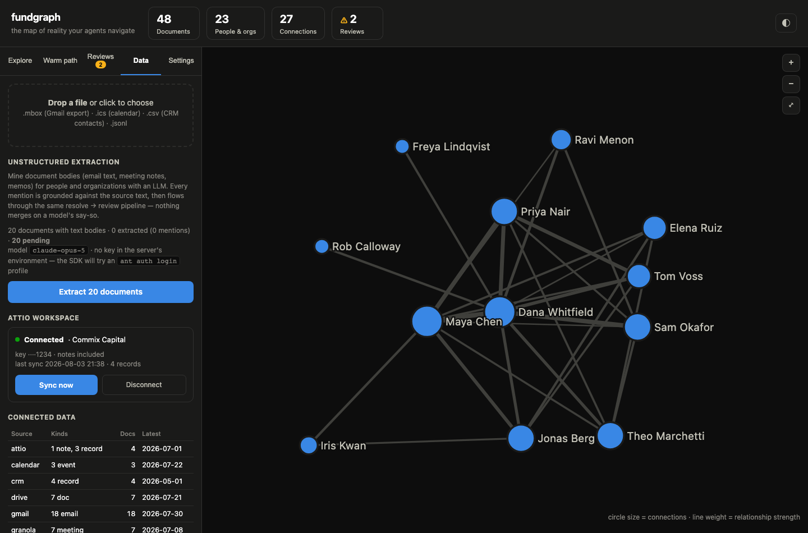
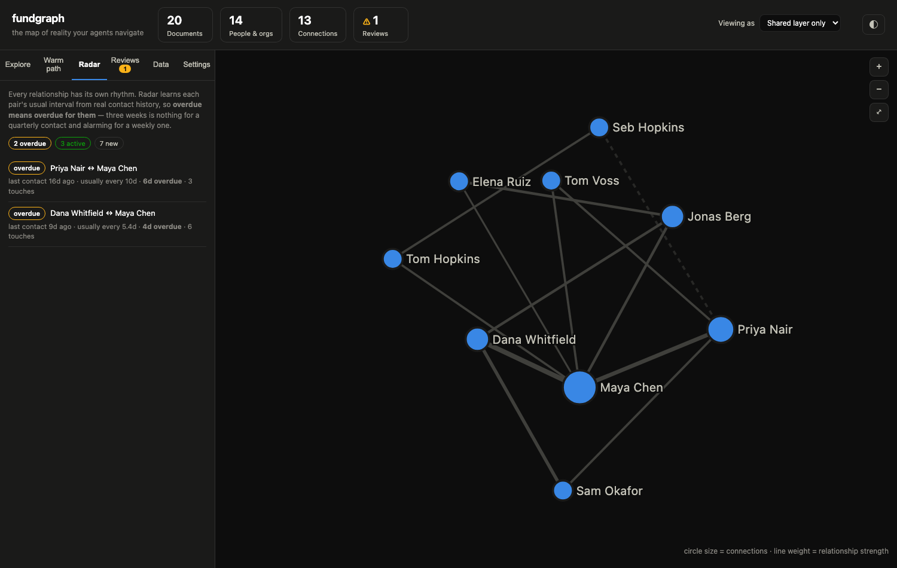
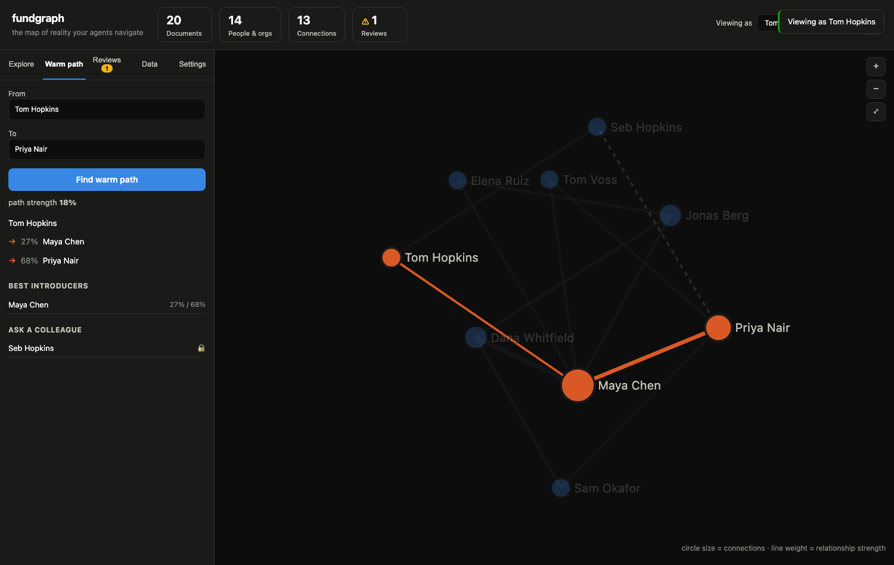

# fundgraph

**Open-source agentic data layer for investment teams.** An entity-resolved knowledge graph over your fund's scattered data — email, calendar, meeting notes, docs, CRM — with a relationship-intelligence dashboard and a single MCP endpoint for Claude, ChatGPT, or Cursor.


Agents can't operate over millions of documents by guessing with vector search: they fetch the wrong things and don't know what exists. fundgraph gives them a deterministic **map of reality** instead — who exists, who knows whom, and how strongly — so retrieval is structured graph traversal, not similarity roulette.

```
systems of record          fundgraph                        consumers
─────────────────    ──────────────────────────    ──────────────────────
gmail    ─┐          ┌─ metadata layer             web dashboard
calendar ─┤  ingest  │  (what was ingested,        Claude / ChatGPT / Cursor
drive    ─┼────────▶ │   when, who's mentioned)      via one MCP endpoint
granola  ─┤          ├─ entity resolution
crm      ─┤          │  (blocking → candidates →
mbox/ics/csv         │   matching → human review)
          │          └─ knowledge graph
          │             (people + orgs, weighted edges,
          │              warm-path traversal)
```

## Quickstart

Requires Node 20+. No database setup — embedded Postgres ([PGlite](https://pglite.dev)) under `./data/`; set `DATABASE_URL` to use real Postgres.

```bash
npm install
npm start          # → http://localhost:4321
```

First run shows onboarding: load the bundled (fictional) sample dataset with one click, or drop in your own export. Embedded mode is **single-process** (a lockfile enforces this): stop the web server before running CLI ingests, or use `DATABASE_URL` to run several processes.

## The dashboard

| | |
|---|---|
|  |  |

- **Explore** — search, click a node, get a brief: strongest relationships *with the signals behind each score* ("3 meetings, 2 emails, 1 co-authored doc"), recent shared documents, one-click Markdown export.
- **Radar** — which relationships need attention now, judged against each pair's own learned cadence.
- **Warm path** — the best route to an introduction, maximizing end-to-end relationship strength, with introducers ranked by their *weaker* leg.
- **Reviews** — matches scoring 0.70–0.95 wait for a human; the system never merges identities on a guess. Decisions are audited and survive rebuilds.
- **Data** — drag-and-drop ingestion, live connectors, team members and their privacy layers, per-source breakdown, audit trail.
- **Settings** — what "a strong relationship" means differs by firm: signal weights, recency half-life, and saturation are editable live; saving rebuilds the graph instantly.

## Ingesting your data

| Source | Command | Setup needed |
|---|---|---|
| Gmail export (Takeout) | `fundgraph ingest export.mbox` | none — streamed, so multi-GB archives are fine |
| Calendar export | `fundgraph ingest calendar.ics` | none |
| Contacts (Google Contacts, Attio, Affinity, any CSV) | `fundgraph ingest contacts.csv` | none |
| Granola (macOS) | `fundgraph ingest-granola` | none — reads the local cache |
| **Attio workspace (live)** | `fundgraph ingest-attio` | `ATTIO_API_KEY` — see below |
| Live Gmail/Calendar/Drive via [gog](https://github.com/steipete/gogcli) | `fundgraph ingest-gog gmail` | gog already authenticated (local, or remote via `FUNDGRAPH_GOG_SSH=user@host`) |
| Live Gmail/Calendar/Drive via Google APIs | `fundgraph ingest-google gmail` | a Desktop OAuth client JSON in `GOOGLE_OAUTH_CREDENTIALS` |

### From a Google Workspace / Takeout export

Works on any account, including one you no longer actively use — you only need
to be able to sign in once.

1. At [takeout.google.com](https://takeout.google.com) (signed in as that
   account) choose **Mail**, **Calendar**, and **Contacts**. For Mail, use
   "All Mail data included" or select specific labels; export as `.zip`.
2. Unzip. You'll get `Takeout/Mail/All mail Including Spam and Trash.mbox`,
   `Takeout/Calendar/*.ics`, and `Takeout/Contacts/contacts.csv`.
3. Ingest — order doesn't matter, entity resolution links them:

```bash
fundgraph ingest "Takeout/Mail/All mail Including Spam and Trash.mbox"
for f in Takeout/Calendar/*.ics; do fundgraph ingest "$f"; done
fundgraph ingest Takeout/Contacts/contacts.csv
fundgraph sync
```

The mbox is streamed and ingested in batches, so archive size is not bounded by
memory (measured ~420 messages/sec — a 100k-message account takes a few
minutes). Contacts exports use Google's own column names
(`E-mail 1 - Value`, `Organization Name`, split first/last), which the CSV
adapter handles directly; multiple addresses on one contact become one entity.

### From an Attio workspace



**In the dashboard** (no terminal): open the **Data** tab → *Attio workspace* →
paste your access token → **Connect & sync**. The key is verified against Attio
before anything is stored, the first pull runs immediately, and the panel then
shows the workspace, last sync, and a **Sync now** button for later refreshes.

Or from the CLI: `export ATTIO_API_KEY=... && fundgraph ingest-attio && fundgraph sync`.

To create the token: in Attio go to **Workspace settings → Developers → Create
an integration**, and grant read scopes for `record` and `object_configuration`
(add `note` to include notes).

A key pasted into the dashboard is stored in your local database and is
**write-only across the API** — no endpoint ever returns it, status shows a
masked hint (`····1234`) only, and it never reaches the audit log. It is stored
in plain text at the same trust level as the graph itself, so for shared or
server deployments prefer the `ATTIO_API_KEY` environment variable (which the
dashboard will detect and use without storing anything). **Disconnect** deletes
the stored key and leaves already-ingested data in place.

Pulls people, companies, and notes. A person's linked company becomes their org
hint, and all of a contact's addresses are attached to one entity — so an Attio
contact and their emails in Gmail resolve to the same person. Pass
`--no-notes` to skip notes (or if your token lacks the scope, notes are skipped
with a warning rather than failing the pull).

Then `fundgraph sync` (resolve + rebuild edges).

**What gets read:** live connectors (Granola, gog, Google APIs, Attio people/companies) read metadata and participant identities only. File exports (`.mbox`, `.ics`, `.csv` notes, `.jsonl`) also capture a size-capped plain-text **body** per document — stored locally in your database and mined only when you explicitly run [unstructured extraction](#unstructured-extraction). Set `FUNDGRAPH_NO_BODIES=1` to skip body capture entirely and keep the old metadata-only behavior.

Adapters emit a common JSONL shape (see `sample/seed.jsonl`); to add a source, emit that shape and `fundgraph ingest file.jsonl`. Ingestion is idempotent: re-ingesting updates in place, and review history is preserved.

## Fixing what resolution missed

Resolution is deliberately conservative — conflicting evidence queues for review
rather than merging — so real data always leaves a few duplicates (a work
address and a personal one for the same person, resolved apart). Merge them:

```bash
fundgraph merge "Alex Rivera" "alex@northgate.io"   # keep the first, absorb the second
fundgraph unmerge "alex@northgate.io"               # reversible
fundgraph merges                                # what's been merged
```

Or in the dashboard: open a profile → **Merge a duplicate…**. Documents,
relationships, and addresses move to the survivor; the loser is kept as a
tombstone rather than deleted, so the merge stays reversible and unmerging gives
back *exactly* what the merge took (leaving an address behind would misroute
future mentions). Like review decisions, merges are human input — they're
recorded and **replayed after a full `reresolve`** instead of being lost.

fundgraph also flags **automated senders** (no-reply robots, notification
services) and hides them from relationship views — on a real inbox they're
otherwise half the graph. Role addresses like `team@` or a client's `hello@` are
treated as hints only and need broadcast behaviour (never replies, never in a
meeting) to be flagged, because a shared mailbox usually has a human behind it.
Nothing is deleted, every flag carries its reason, and `fundgraph automated
--list` shows the lot.

## Relationship radar — the timing layer



Strength answers *who do I know well*. Radar answers *who should I contact now*.
Each pair's natural cadence is learned from real contact history, so **overdue
means overdue for them**: three weeks of silence is unremarkable with a
quarterly contact and alarming with a weekly one.

```bash
fundgraph radar                      # whole graph, most actionable first
fundgraph radar "Maya Chen"          # one person's relationships
```

Every row carries its receipts — "last contact 16d ago · usually every 10d ·
6d overdue · 3 touches" — and statuses (`active`, `due`, `overdue`, `cold`,
`dormant`, `new`) plus a warming/steady/cooling trend comparing the last 90 days
with the 90 before. With no contact in either window the trend is `null` rather
than a fabricated "steady". Entirely deterministic: intervals and dates, no
model in the loop. Radar respects privacy layers, and agents get it as the
`relationship_radar` MCP tool.

## Privacy layers



A relationship graph is only useful if people are willing to put their inbox in
it — and nobody wants to hand their personal email to the whole team. So each
member connects their own sensitive sources into a **private layer** that lives
inside the shared graph:

- **Evidence is private.** Connection strengths, signals, and documents from a
  member's layer are visible only to them. Another member's brief on the same
  person shows a `withheldDocuments` count and nothing else.
- **Existence is shared.** If the only route to someone runs through a
  colleague's private layer, you're told the route exists, which hop is locked,
  and *who to ask* — with no strength attached. That's the whole point of a
  relationship graph: "Seb can reach Priya, ask him."
- **Layers combine, they don't replace.** Your own evidence is summed with the
  shared layer before saturation, so private data reinforces public data.

```bash
fundgraph members add "Seb Larkin" seb@ridgeline.vc
fundgraph ingest seb-inbox.mbox --as "Seb Larkin"   # → Seb's private layer
fundgraph path "Tom Merrill" "Priya Nair" --as "Tom Merrill"
```

In the dashboard, the **Viewing as** switch in the header changes layer; the
Data tab manages members. For agents, `FUNDGRAPH_VIEWER=<member>` binds an MCP
server to one person's view.

**What "existence is shared" actually means.** A person the firm already knows
(they appear in any shared document) stays visible to everyone, and a colleague's
private correspondence with them surfaces as a locked hop — that is the feature.
But an entity that appears *only* inside one member's private layer is hidden
entirely by default, because the name itself can be the secret ("Project
Nightjar"). Set `privateEntityVisibility: "reveal"` in Settings to opt into the
fully-shared-names model instead; it is a deliberate choice, not a default.
Removing a member forces an explicit choice: delete their documents, or move
them into the shared layer where everyone will see them. Enforcement is
server-side on every query and `npm test` includes a **leak probe** that stuffs
markers into a private layer and greps every endpoint's response as another
member, but this is a **cooperative** model for a trusted
team on one local database, not a hostile-tenant boundary: anyone with
filesystem access to `./data` or the ability to pass an arbitrary `?as=` can
read any layer. Real multi-tenant isolation needs authentication, which is on
the roadmap below.

## Design principles

1. **Everything resolves to two entities: people and organizations.** Deals, funds, docs hang off those two.
2. **Two-layer data model.** A metadata layer tracks what was ingested and who was mentioned; the knowledge graph holds resolved entities and weighted connections. The graph is a read model — rebuilt deterministically, never hand-edited.
3. **Four-stage entity resolution:** blocking → candidate generation → probabilistic matching → human review. Deterministic auto-merge at ≥0.95 confidence; 0.70–0.95 queues for a human; conflicting evidence (same name, different work domain) always asks. Without this, one person appears as 100+ duplicates across sources.
4. **Never let an LLM score a relationship.** Connection strength is computed from observable signals — meeting frequency, email reciprocity, co-authorship, recency decay — because models will confidently hallucinate a 3/10 relationship as a 10/10.
5. **Graph-based retrieval, not pure vector.** "Who can intro me to X?" is a weighted shortest-path query, answered with the evidence behind each hop.

## MCP — agents on the graph

```bash
claude mcp add fundgraph -- node /path/to/fundgraph/src/cli.js mcp
```

Tools: `meeting_prep` (one call: profile + relationship history + receipts + your warm paths to them), `company_memory` (every recorded deal signal for a company — investments *and passes with their reasoning* — with document provenance), `find_warm_path`, `find_introducers`, `entity_brief`, `search_entities`, `strongest_connections`, `graph_stats`, `review_queue`, `review_resolve`.

## CLI

```
fundgraph web [port]              dashboard (default 4321)
fundgraph ingest <file>           .jsonl | .mbox | .ics | .csv
fundgraph ingest-granola [path]   Granola local cache (macOS)
fundgraph ingest-gog <service>    live pull via gog: gmail | calendar | drive
fundgraph ingest-google <service> live pull via Google APIs
fundgraph sync [--extract]        resolve + rebuild edges (--extract mines bodies first)
fundgraph extract [--limit N]     LLM mention extraction over unprocessed bodies
fundgraph reresolve               rebuild entities from scratch (decisions replayed)
fundgraph entities | brief | path | intros | review | stats
fundgraph mcp                     MCP server (stdio)
```

## Unstructured extraction

Headers and attendee lists are a fraction of what a fund knows. The bodies — "our
IC chair Alistair Penhale has asked…", "Sam Okafor at Halcyon co-invested with us
on three deals" — name people and organizations no structured field ever sees.
`fundgraph extract` mines them with an LLM and feeds the results through the
*same* resolution, review, and edge pipeline as everything else:

```bash
export ANTHROPIC_API_KEY=...      # or `ant auth login`
fundgraph extract                 # mine all unprocessed bodies
fundgraph sync --extract          # or as part of a sync
```

(Or press **Extract pending documents** on the dashboard's Data tab.)

Extraction never gets to bend the graph's rules:

- **Structured output, not free text** — the model can only return typed
  mention candidates; a prompt-injected document can at worst distort which
  candidates come back, never make the pipeline do something.
- **Deterministic grounding** — every candidate must literally appear in the
  document text. Names not in the text are dropped; emails are kept only if the
  exact address string is present (a model can never "complete"
  `name@domain` into existence); low-confidence candidates are dropped.
- **Same trust model as any mention** — extracted mentions carry
  `origin='extracted'`, a confidence, and a verbatim source quote; they resolve
  through blocking → matching → human review like structured mentions, and
  co-occurrence is damped by the merely-`mentioned` factor. Connection strength
  stays deterministic (principle 4): the LLM proposes candidates; it never
  scores a relationship.
- **Idempotent + resumable** — each document records a hash of
  (prompt version, model, body); re-runs skip clean documents, re-extract
  changed ones, and retry failures. Three consecutive failures abort the run.

Extraction also mines **fund memory**: when a document records an investment
decision (an IC memo's INVEST or PASS, a board pack, a round discussion), a
`deal` record is kept — company, stage, status, the stated reasoning, and the
document it came from. `fundgraph memory <company>` or the `company_memory`
MCP tool answers the question every fund eventually asks: *"have we seen this
company before, and why did we say no?"* Deals hang off organizations
(principle 1) and link to entities at query time, so rebuilds never orphan
them; passes are first-class, because a recorded no is the memory that saves
the next diligence cycle.

Configuration: `FUNDGRAPH_EXTRACT_MODEL` (default `claude-opus-5`;
`claude-haiku-4-5` is the budget option), `FUNDGRAPH_EXTRACT_EFFORT`
(default `low`), `FUNDGRAPH_EXTRACT_MIN_CONFIDENCE` (default `0.6`).
Details, cost notes, and the threat model: [docs/extraction.md](docs/extraction.md).

## How connection strength works

Each co-occurrence contributes `weight(kind) × decay(age)`: meetings 3, calendar events 2, direct emails 2.5 (cc'd 1), co-authored docs 1.5, merely-`mentioned` participants halved — 180-day half-life. Strength is `1 − e^(−W/6)`, saturating toward 1. Warm paths maximize the product of hop strengths (hop-bounded Dijkstra over `−ln(strength)`). Every number is tunable in Settings, per database.

## Testing

```bash
npm test    # resolution smoke suite + API suite + extraction suite
```

The extraction suite runs the full pipeline against a scripted fake model —
grounding, idempotency, failure isolation, and resolution integration are all
covered offline; no API key needed.

Both suites run on throwaway databases. The codebase has been through three adversarial multi-agent review passes; all 27 confirmed findings are fixed with regression coverage (see CHANGELOG).

## Status & roadmap

Working today: everything above. Not yet built (PRs welcome):

- **Bodies from live connectors** — file exports capture bodies today; the Granola/gog/Google/Attio live pulls are still metadata-only
- **Batch extraction** — large backfills through the Anthropic Batches API at 50% token cost
- **Authentication** — privacy layers are enforced on every query but assume a trusted team on one machine; real multi-tenant isolation needs login and per-user sessions
- **Scheduled sync** — periodic re-pull from live sources

## License

MIT
