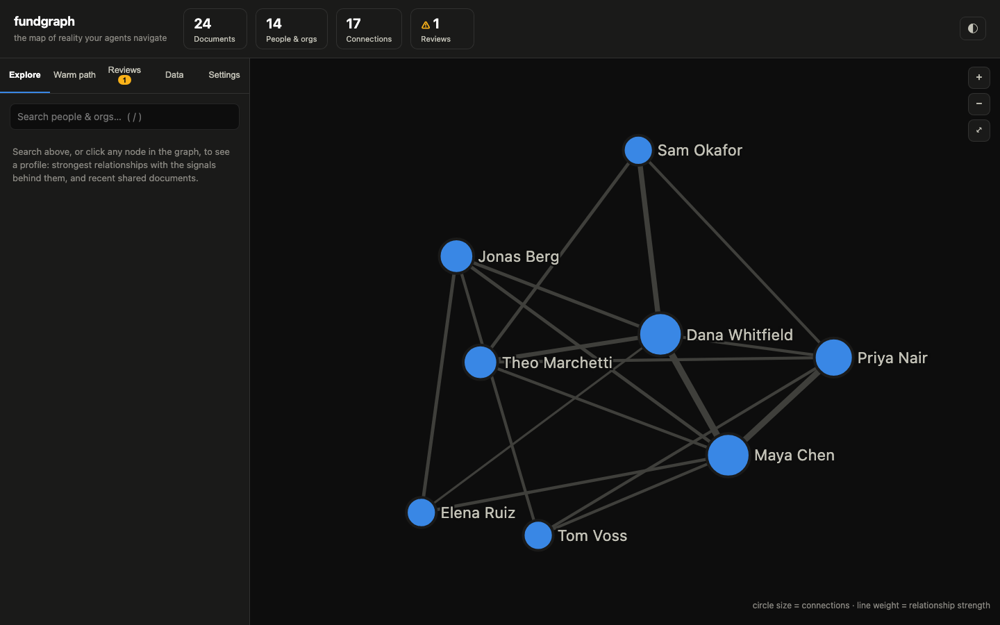
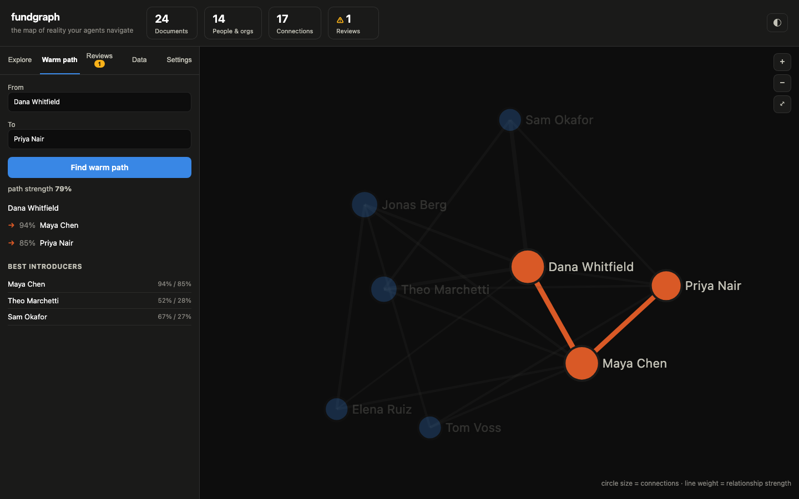
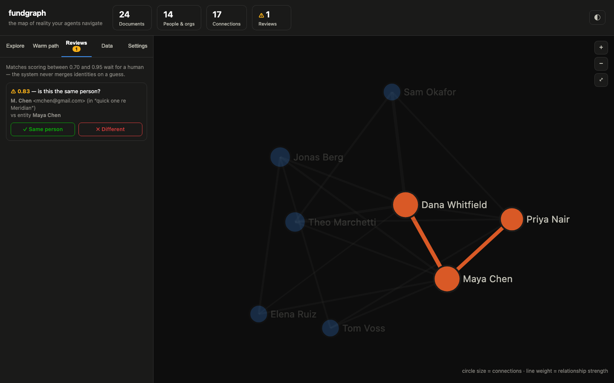

# fundgraph

**Open-source agentic data layer for investment teams.** An entity-resolved knowledge graph over your fund's scattered data — email, calendar, meeting notes, docs, CRM — with a relationship-intelligence dashboard and a single MCP endpoint for Claude, ChatGPT, or Cursor.



Agents can't operate over millions of documents by guessing with vector search: they fetch the wrong things and don't know what exists. fundgraph gives them a deterministic **map of reality** instead — who exists, who knows whom, and how strongly — so retrieval is structured graph traversal, not similarity roulette.

```
systems of record          fundgraph                        consumers
─────────────────    ──────────────────────────    ──────────────────────
gmail    ─┐          ┌─ metadata layer             web dashboard
calendar ─┤  ingest  │  (what was ingested,        Claude / ChatGPT / Cursor
drive    ─┼────────▶ │   when, who's mentioned)      via one MCP endpoint
granola  ─┤          ├─ entity resolution
crm      ─┤          │  (blocking → candidates →
mbox/ics/csv         │   matching → human review)
          │          └─ knowledge graph
          │             (people + orgs, weighted edges,
          │              warm-path traversal)
```

## Quickstart

Requires Node 20+. No database setup — embedded Postgres ([PGlite](https://pglite.dev)) under `./data/`; set `DATABASE_URL` to use real Postgres.

```bash
npm install
npm start          # → http://localhost:4321
```

First run shows onboarding: load the bundled (fictional) sample dataset with one click, or drop in your own export. Embedded mode is **single-process** (a lockfile enforces this): stop the web server before running CLI ingests, or use `DATABASE_URL` to run several processes.

## The dashboard

| | |
|---|---|
|  |  |

- **Explore** — search, click a node, get a brief: strongest relationships *with the signals behind each score* ("3 meetings, 2 emails, 1 co-authored doc"), recent shared documents, one-click Markdown export.
- **Warm path** — the best route to an introduction, maximizing end-to-end relationship strength, with introducers ranked by their *weaker* leg.
- **Reviews** — matches scoring 0.70–0.95 wait for a human; the system never merges identities on a guess. Decisions are audited and survive rebuilds.
- **Data** — drag-and-drop ingestion, per-source breakdown, audit trail.
- **Settings** — what "a strong relationship" means differs by firm: signal weights, recency half-life, and saturation are editable live; saving rebuilds the graph instantly.

## Ingesting your data

| Source | Command | Setup needed |
|---|---|---|
| Gmail export (Takeout) | `fundgraph ingest export.mbox` | none |
| Calendar export | `fundgraph ingest calendar.ics` | none |
| CRM contacts (Attio/Affinity/any) | `fundgraph ingest contacts.csv` | none |
| Granola (macOS) | `fundgraph ingest-granola` | none — reads the local cache |
| Live Gmail/Calendar/Drive via [gog](https://github.com/steipete/gogcli) | `fundgraph ingest-gog gmail` | gog already authenticated (local, or remote via `FUNDGRAPH_GOG_SSH=user@host`) |
| Live Gmail/Calendar/Drive via Google APIs | `fundgraph ingest-google gmail` | a Desktop OAuth client JSON in `GOOGLE_OAUTH_CREDENTIALS` |

Then `fundgraph sync` (resolve + rebuild edges). **Only metadata and participant identities are read — message bodies, transcripts, and file contents are never fetched or stored.**

Adapters emit a common JSONL shape (see `sample/seed.jsonl`); to add a source, emit that shape and `fundgraph ingest file.jsonl`. Ingestion is idempotent: re-ingesting updates in place, and review history is preserved.

## Design principles

1. **Everything resolves to two entities: people and organizations.** Deals, funds, docs hang off those two.
2. **Two-layer data model.** A metadata layer tracks what was ingested and who was mentioned; the knowledge graph holds resolved entities and weighted connections. The graph is a read model — rebuilt deterministically, never hand-edited.
3. **Four-stage entity resolution:** blocking → candidate generation → probabilistic matching → human review. Deterministic auto-merge at ≥0.95 confidence; 0.70–0.95 queues for a human; conflicting evidence (same name, different work domain) always asks. Without this, one person appears as 100+ duplicates across sources.
4. **Never let an LLM score a relationship.** Connection strength is computed from observable signals — meeting frequency, email reciprocity, co-authorship, recency decay — because models will confidently hallucinate a 3/10 relationship as a 10/10.
5. **Graph-based retrieval, not pure vector.** "Who can intro me to X?" is a weighted shortest-path query, answered with the evidence behind each hop.

## MCP — agents on the graph

```bash
claude mcp add fundgraph -- node /path/to/fundgraph/src/cli.js mcp
```

Tools: `meeting_prep` (one call: profile + relationship history + receipts + your warm paths to them), `find_warm_path`, `find_introducers`, `entity_brief`, `search_entities`, `strongest_connections`, `graph_stats`, `review_queue`, `review_resolve`.

## CLI

```
fundgraph web [port]              dashboard (default 4321)
fundgraph ingest <file>           .jsonl | .mbox | .ics | .csv
fundgraph ingest-granola [path]   Granola local cache (macOS)
fundgraph ingest-gog <service>    live pull via gog: gmail | calendar | drive
fundgraph ingest-google <service> live pull via Google APIs
fundgraph sync                    resolve + rebuild edges
fundgraph reresolve               rebuild entities from scratch (decisions replayed)
fundgraph entities | brief | path | intros | review | stats
fundgraph mcp                     MCP server (stdio)
```

## How connection strength works

Each co-occurrence contributes `weight(kind) × decay(age)`: meetings 3, calendar events 2, direct emails 2.5 (cc'd 1), co-authored docs 1.5, merely-`mentioned` participants halved — 180-day half-life. Strength is `1 − e^(−W/6)`, saturating toward 1. Warm paths maximize the product of hop strengths (hop-bounded Dijkstra over `−ln(strength)`). Every number is tunable in Settings, per database.

## Testing

```bash
npm test    # 38-assertion resolution smoke suite + 34-assertion API suite
```

Both suites run on throwaway databases. The codebase has been through three adversarial multi-agent review passes; all 27 confirmed findings are fixed with regression coverage (see CHANGELOG).

## Status & roadmap

Working today: everything above. Not yet built (PRs welcome):

- **Privacy layers** — per-user private sources contributing to shared answers without exposing underlying data ("a warm path exists via X" without X's emails)
- **LLM mention extraction** — pulling people/orgs out of unstructured doc bodies (adapters currently use structured metadata only)
- **Merge/split tooling** — merging two entities discovered to be the same person; undo for bad merges
- **Access control** — role-based visibility for multi-user teams
- **Scheduled sync** — periodic re-pull from live sources

## License

MIT
